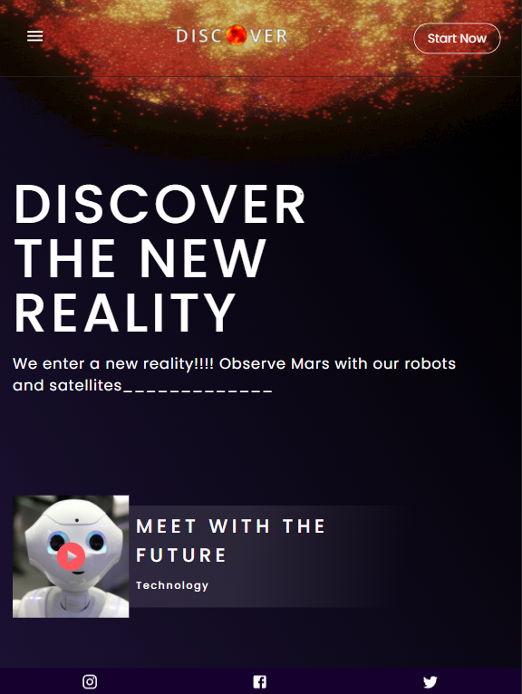

# Layout with React JS using NASA API

## Website link on the web: [Click Here](https://discover-nasa-api.netlify.app/)

 

## Preview:

---

## Website in different screen sizes:

---
## If you want to test it on your machine:

 

### First run the command to clone the project on your machine:
    git clone https://github.com/anastaciom/layout-reactJS.git

 

### Enter the project folder:

    cd layout-reactJS

 

### Inside the "layout-reactJS" folder, install all dependencies by running:

    npm install

 

### Now, to run the project:

    npm start

### __will run at http://localhost:3000/__

 

---

## Dependencies used:

- ### __Commitizen__
- ### __Commitizen CLI__
- ### __Material-UI__
- ### __Axios__
- ### __Redux__
- ### __Redux-Thunk__
- ### __React-Redux__
- ### __React-Spinners__
---
## API used:
- ### __Nasa API (Mars Rover Photos)__

---
#### __Design was inspired by one from Dribbble: https://dribbble.com/shots/17305752-3D-visuals-and-smooth-animation__
